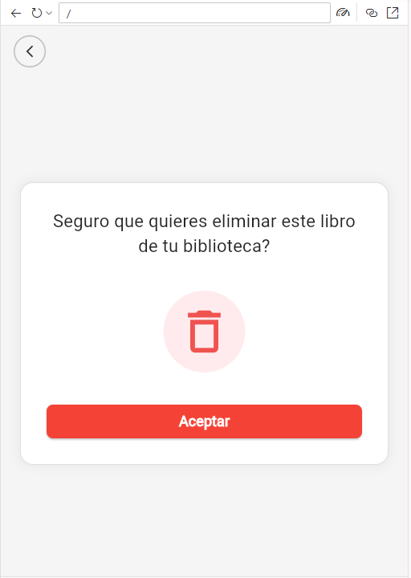
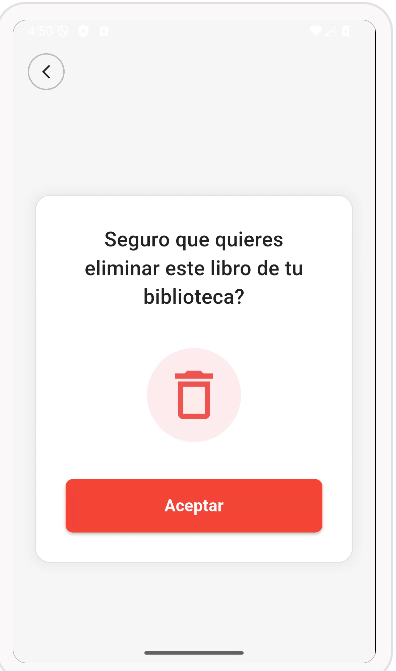

# myapp

# mi prompt
Genera el código completo de un archivo main.dart en Flutter utilizando la sintaxis más reciente con .withValues para los colores; estructura el diseño empleando filas y columnas de manera que incluya una fila en la parte superior para un botón de retroceso circular alineado a la izquierda, y una columna central que contenga una tarjeta blanca con el mensaje '¿Seguro que quieres eliminar este libro de tu biblioteca?', un ícono de bote de basura en color rojo y un botón de 'Aceptar' rojo en la parte inferior.

## mi diseño

